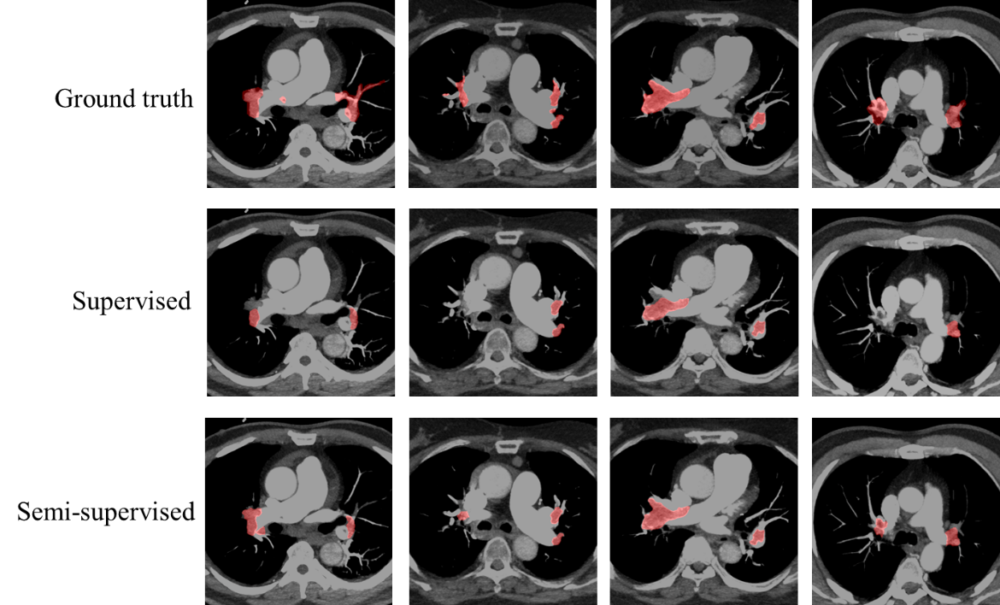
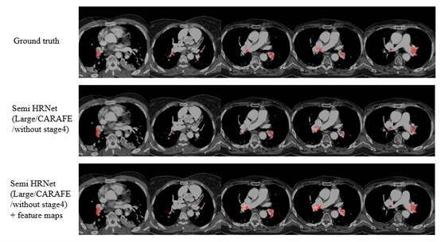

# Feature-enhanced Adversarial Semi-supervised Semantic Segmentation Network for Pulmonary Embolism Annotation

This repository refers to the pytorch implementation of the following paper:

[Adversarial Learning for Semi-supervised Semantic Segmentation](https://arxiv.org/abs/1802.07934) <br/>


The code are heavily borrowed from a pytorch implementation ([Link](https://github.com/hfslyc/AdvSemiSeg.git)). The backbone model is HRNet (Large/CARAFE/without stage4)([Link](https://github.com/HRNet/HRNet-Semantic-Segmentation.git)). We strengthened the ability of the discriminator by adding feature maps to the predicted label and then using it as the input of the discriminator during training and the bilinear upsampling layer of HRNet in the decoder was replaced with the CARAFE upsampling module ([link](https://github.com/leftthomas/CARAFE.git)) to better restore the PE shape and position., which yields mIOU ``0.3721``, dice score ``0.5113`` and sensitivity``0.4967`` ,on dataset from China Medical University Hospital (CMUH), NCKUH dataseta and open source dataset ([link](https://pubmed.ncbi.nlm.nih.gov/30179235/)).


## Prerequisite

* CUDA/CUDNN
* pytorch >= 0.2 (We only support 0.4 for evaluation. Will migrate the code to 0.4 soon.)
* python-opencv >=3.4.0 (3.3 will cause extra GPU memory on multithread data loader)


## Installation

* Clone this repo

```bash
git clone https://github.com/hfslyc/AdvSemiSeg.git
```

## Example visualizing the result on medical image

 
 The segmentation results of predicted computed tomography pulmonary angiogram (CTPA) images for pulmonary embolism (PE) lesion areas were obtained from the NCKUH dataset. Similar to the results on the open-source dataset, semi-supervised training reduced the number of false negatives.


 
 Predicted images of semi-supervised segmentation in the open source dataset. The second row shows our model without the addition of feature maps before the discriminator. The third row shows that the addition of feature maps before the discriminator reduced the number of false negatives.
 
